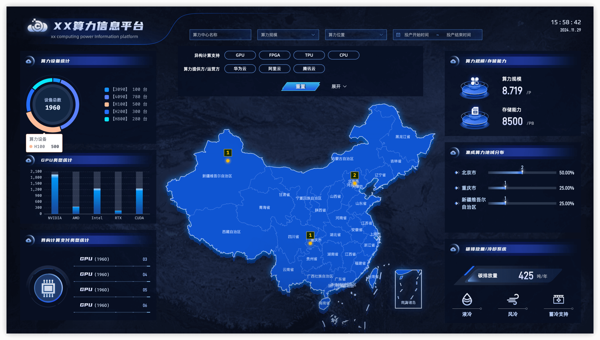

# 算力信息平台

- 项目由 [nuxt](https://nuxt.com/) 搭建的算力大屏，用 [Echarts](https://echarts.apache.org/examples/zh/index.html#chart-type-map) 实现地图效果上踩了不少坑，现将项目早期版本分享给大家，本地 mock 数据，希望能有所帮助。
- 依赖版本：
  
- 效果截图：
  
- 在线预览:

| 访问地址 | 部署 | 状态 |
| :---: | :---: | :---: |
|[](https://infomation-platform.vercel.app/)|[](https://vercel.com/new/clone?repository-url=https://github.com/wwlight/infomation-platform)|[](https://vercel.com/wwlight/infomation-platform)|
|[](https://infomation-platform.netlify.app/)|[](https://app.netlify.com/start/deploy?repository=https://github.com/wwlight/infomation-platform)|[](https://app.netlify.com/sites/infomation-platform/deploys)|

- `echarts` 地图相关 `geoJson` 文件下载地址：[DataV.GeoAltas](https://datav.aliyun.com/portal/school/atlas/area_selector)
- 可直接运行下载脚本: `node ./public/download-datav-maps.cjs`
- `echarts` 地图轮廓、投影、立体效果在 [`./utils/useMapChart.ts`](./utils/useMapChart.ts) 配置文件中
- 支持地图下钻功能

## 设置

```bash
# npm
npm install

# pnpm
pnpm install

# yarn
yarn install

# bun
bun install
```

## 本地运行

```bash
# npm
npm run dev

# pnpm
pnpm dev

# yarn
yarn dev

# bun
bun run dev
```

## 打包

```bash
# npm
npm run build

# pnpm
pnpm build

# yarn
yarn build

# bun
bun run build
```
